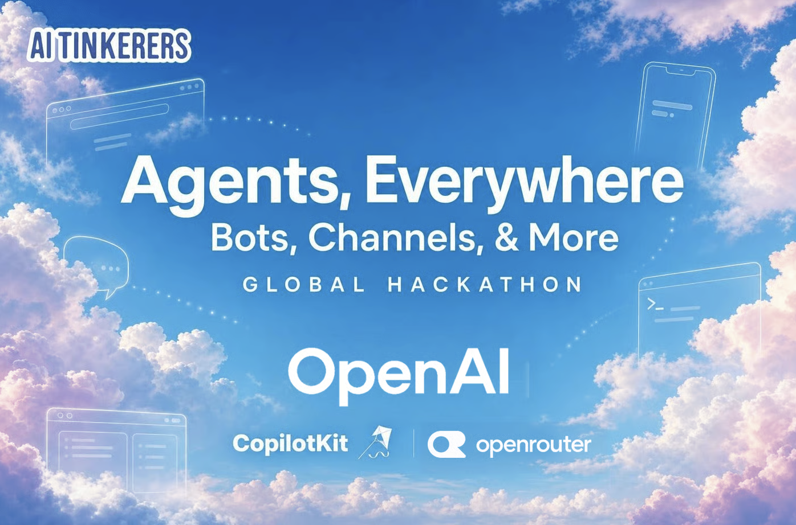
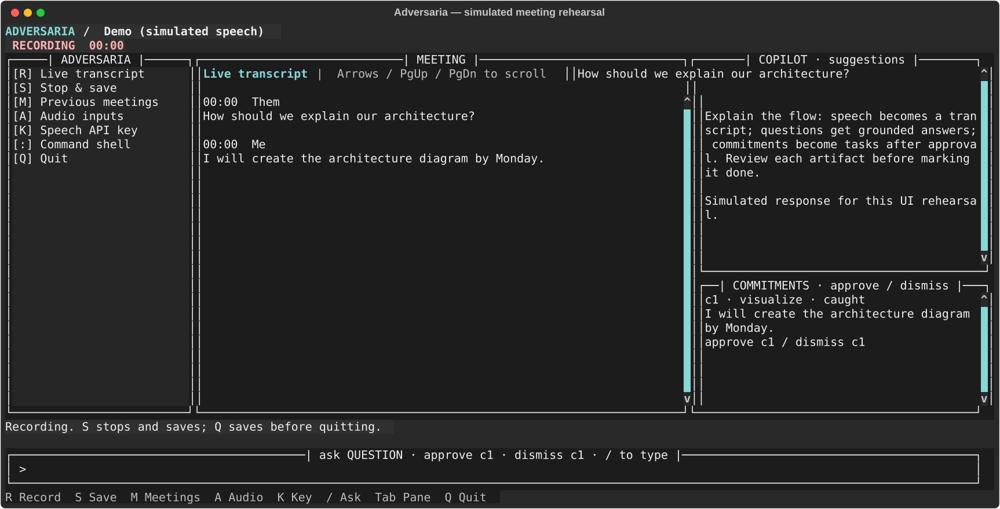

# Adversaria



## Agents Everywhere hackathon submission

**This work builds on Adversaria, the ongoing Laghari Labs project that
Mohammad Hamza Laghari (Hamza) is building.** The meeting recorder, local notes,
Copilot and Workspaces existed before today. This submission extends that project
with two builds from the September 12, 2026 hackathon.

**A meeting copilot that turns spoken commitments into reviewable work.**
Adversaria listens to a meeting, offers answers grounded in your workspace,
and catches promises such as “I will create an architecture diagram by Monday.”
You decide which commitments become tasks. Agents draft the deliverable; you
review it before marking it complete.

### Why I built Adversaria

As a lead AI engineer, I attend many meetings. The action items can take an hour
or two apiece, and I also have my own projects to build. The meetings end, but
the work keeps piling up.

I built Adversaria to take my meeting notes, suggest what to talk about, and
help carry the follow-up work into Spaces (called **Workspaces** in the app).
There, I can build on the meeting context, research a question, or generate a
solutions architecture diagram to review. The desktop's fully local mode keeps
meeting audio, transcripts and model processing on my machine. Cloud models
and web research are optional and require an explicit choice.

### What I built today

1. **Copilot + Spaces improvements.** I built on the existing Copilot and
   Workspaces to catch spoken commitments during a meeting, let me approve them
   as tasks, and follow their progress through to a draft. The compact companion
   fits beside a call, and Workspaces previews generated architecture diagrams
   so I can review the result and keep building on it.
2. **Adversaria CLI.** I built a terminal edition that brings meeting capture,
   Copilot suggestions, workspaces and task execution together using the
   configured provider API keys: OpenRouter for speech and model responses,
   Exa for web research, and optional direct OpenAI support. It can also run
   tasks through an existing Codex login. This edition uses cloud services and
   has its own local storage.

See [HACKATHON.md](HACKATHON.md) for the detailed split between prior work and
today's additions.

**Why I built Adversaria, in eight slides:**
[PDF](marketing/adversaria-story/output/adversaria-story.pdf),
[editable PowerPoint](marketing/adversaria-story/output/adversaria-story-v3.pptx),
or [browser presentation](marketing/adversaria-story/output/adversaria-story.html).
The deck follows the Laghari Labs design and includes
[presenter notes](marketing/adversaria-story/output/presenter-notes.md).

### Run the terminal demo

```bash
git clone https://github.com/mhlaghari/adversaria-agents-everywhere.git
cd adversaria-agents-everywhere
./adversaria setup
./adversaria
```

Requires Python 3.11+ and [uv](https://docs.astral.sh/uv/). Setup prompts privately
for OpenRouter and Exa keys. Windows: `.\adversaria.ps1 setup`, then
`.\adversaria.ps1`. No desktop build or local model downloads are required.

The full-screen interface has **boxed transcript, Copilot suggestions, and
commitment panes**, plus a command bar. It runs in a normal terminal or inside
tmux. Run `./adversaria tmux` to create or attach a persistent tmux session
(detach with Ctrl-B then D). Use a wide terminal to see the action menu beside all three panes.



*Interface rehearsal with simulated speech and a simulated model response.*

### Two-minute walkthrough

1. Press **K** to configure speech if needed, **A** to choose audio inputs, then
   **R** to record. Captions appear in the transcript pane.
2. Ask aloud, “What should we include in our architecture proposal?” Copilot
   streams a suggested answer using recent conversation and attached evidence.
   You can also press **/** and type `ask What should I say next?`, or
   `search latest speech recognition research` to use Exa-backed evidence.
3. Say, “I will create an architecture diagram by Monday.” The commitment appears
   beside the transcript. Press **/** and type `approve c1` to queue it, or
   `dismiss c1` to discard it. Nothing runs on a spoken promise alone.
4. Press **S** to stop and save. **M** opens previous meetings. Press **:** to
   enter the command companion, then `work` to run approved queued tasks,
   `task artifact 1` to review the draft, and `task approve 1` to mark it done.

Prepare grounded demo context beforehand:

```bash
./adversaria workspace create "Hackathon"
./adversaria workspace attach cli/examples/context.md
./adversaria
```

A microphone-free detector rehearsal is also available:
`./adversaria replay cli/examples/meeting.txt`.

### What powers it

| Component | Role |
| --- | --- |
| OpenRouter | Cloud speech transcription and streaming model answers |
| Exa | Automatic lookup for outside questions; explicit `search` / `--web` for research tasks |
| Codex | Optional task engine using an existing Codex login |
| SQLite + workspace files | Meeting history, source evidence, queued tasks and artifacts |
| prompt_toolkit | Boxed terminal dashboard, keyboard navigation and live panes |

```text
Microphone / loopback → speech transcription → live transcript
                                             ├─ question → grounded Copilot answer
                                             └─ commitment → user approval → queued task
Workspace evidence + optional Exa research → agent draft → artifact review
```

### Scope and honest limitations

The CLI and live commitment workflow are the hackathon additions. The desktop
meeting recorder, local transcription and encrypted storage predate this work;
[HACKATHON.md](HACKATHON.md) records the boundary. The desktop documentation follows
below, and [cli/README.md](cli/README.md) contains the full terminal guide.

The CLI uses cloud services and its own plaintext local storage; it does not read
or synchronize the desktop database. Audio goes to the selected speech provider.
OpenRouter transcription is request-based: a 400 ms pause closes speech, and
continuous speech is segmented every four seconds. Provider processing and queue
backlog add latency; these are **not word-by-word streaming captions**. Requests
run concurrently with ordered caption delivery. A credentialed synthetic-speech
rehearsal returned its first caption at 4.1 seconds and a completed Copilot answer
at 5.3 seconds from audio playback start. Actual microphone latency varies; see
[provider checks](cli/PROVIDER_CHECK.md). Channel labels identify
microphone/loopback, not individual people. Capturing the other side requires
routing call audio to a loopback input such as BlackHole.

### Validation

```bash
uv run --project cli pytest cli/tests -q
uv run --project cli ruff check cli
uv run --project cli ruff format --check cli
```

Tests exercise cloud stream contracts, speech boundaries, commitment approval,
workspace grounding, task lifecycle, keyboard navigation, final-caption saving,
recovery after failures and terminal closure. UI rehearsals use explicitly
simulated speech; they do not establish real microphone or provider latency.

## Desktop edition

> Formerly "Meeting Note Taker". The app/bundle is now **Adversaria** (a Laghari
> Labs product). The on-disk data dir is still `meeting-note-taker`, so existing
> meetings carry over unchanged.

A privacy-first, bot-free AI meeting notetaker for **Windows and macOS** (Apple
Silicon), inspired by Granola. It records your system audio **and your microphone**
during a meeting (no bot joins the call), transcribes it locally with your pick
of on-device engines — **Whisper**
([faster-whisper](https://github.com/SYSTRAN/faster-whisper) on Windows/CUDA,
MLX on Apple Silicon), **Qwen3-ASR** (52 languages, auto-detected), or **Cohere
Transcribe** (accuracy pick, 14 languages) — and generates structured notes with
a managed local LLM (Rapid-MLX on macOS, or Ollama on Windows). In the default local mode, meeting
audio, transcripts, and prompts stay on the machine. Optional cloud/BYOK modes
are explicit and disclosed before use; see [the network-boundary guide](docs/PRIVACY_NETWORK_BOUNDARIES.md).

## Pull and run

```
git clone https://github.com/mhlaghari/adversaria-agents-everywhere.git
cd adversaria-agents-everywhere
./start.sh        # macOS (Apple Silicon)
.\start.ps1       # Windows 10/11 (PowerShell)
```

One command per OS. It checks the toolchain (Node, Rust, uv, ffmpeg, Ollama), installs what is missing, pulls the local models, starts the Python service, waits for it to be healthy and launches the app in dev mode. Dev mode is what shows the **Workspaces** tab; the **Copilot** tab is inside the recording companion. First run downloads the Whisper model and a 3 GB local LLM. See `HACKATHON.md` for what is prior work and what was built at the hackathon.

## Features

- **Live commitments → workspace tasks** *(hackathon development slice, 2026-09-12; native rehearsal pending)* — confirmed meeting commitments appear in Copilot for **Approve** or **Dismiss**. Approve creates a task with a **Live** chip and makes it available to the workspace's agent engine; paused agents leave it queued until resumed. Nothing is created before approval. Use a Local workspace for the on-device demo.
- **Record → transcribe → summarize**, fully on-device; the audio is deleted right after.
- **A recording companion view** — while recording, the app collapses into a slim panel made for docking beside a call: record bar (timer · live audio level · Stop & summarize), an auto-scrolling live transcript, and your notes split 50/50 (or pick **Transcript-first** in Settings → Recording view to give the transcript the whole window, notes in a one-tap footer). Toggle recording from anywhere with **⌘⇧M** (macOS) / **Ctrl+Shift+M** (Windows); **⌘⇧N** jots a quick note.
- **Live captions preview** — while you speak, grey English words appear within about half a second and revise as you go; at each pause the confirmed Whisper caption replaces them. Fully on-device: a 44 MB Moonshine model (sherpa-onnx) downloads once on first launch, with a status row in Settings → Transcription. English-only for now; other languages keep the confirmed captions.
- **Meeting Room** — at wide window sizes the live transcript docks beside your notes instead of stacking above them, and **+ add context** lets you attach reference documents or prior meetings mid-recording. An attached prior meeting gets a **follow-up check** in the notes ("Follow-up from <meeting>": each of its open action items marked Done / Discussed with a verbatim quote from this transcript, or Still open); attached files are used as reference material; the finished note shows a **Context used** strip naming your typed notes and every attachment.
- **Last time and Copilot tabs** *(merged to master 2026-09-03, ships in the next release)* — while recording, the right column gains **Last time** (what happened in this folder's previous meeting: open action items you can tick off, decisions, follow-ups — straight from your notes, no AI) and **Copilot** (when the other side asks something, verbatim passages from your own notes, past meetings, and attached files appear within about two seconds — local retrieval only, nothing leaves the machine). The recording is filed into the folder you were viewing when you pressed record.
- **A floating recording pill** — switch away from the app mid-recording and a compact pill tucks in just below the notch (dot · timer · live waveform). Choose **Notch pill → Expressive** in Settings → Notch & alerts for a richer island — timer, the running live caption, both channels, and a one-tap Stop — or **Hidden** to turn it off.
- **Speaker-labeled** transcript (`Me:` / `Them:`, with on-device **Speaker 1/2/… diarization** of the remote side); notes in **10 languages** (English, العربية, 中文, हिन्दी, Español, Français, বাংলা, Português, Русский, اردو — or *Match spoken*), RTL rendered properly.
- **Fix this word** — select a misheard term in the transcript, type the correction, and every mention in the transcript *and* notes updates; the term joins your dictionary so future meetings hear it right. **Rename an attendee** on their chip and every reference follows.
- **Appearance themes** — Dark (default), Light, Cream, Navy, Laghari Labs, or System, from Settings → General.
- **Smart note templates** — the app detects what a recording is (watched video, brainstorm, 1:1, **job interview — either side of the table**) and picks the matching notes template automatically; your manual template choice always wins.
- **Meeting Insights** — on-device speaking stats per meeting (talk-time share, pace vs the 130–175 wpm target, filler-word rate, interruptions, longest monologue) computed with zero AI calls; transcripts carry **[MM:SS] timestamps** per turn.
- **To-dos** — action items from every meeting on a **triage board** (Overdue / This week / Later lanes with **drag-and-drop** — drops edit the due date) or a **focus queue** (one next-up card at a time), with meeting-scope chips, editable due dates, and **twice-daily due/overdue notification digests**.
- **Folders** — file related meetings into coloured folders from the Meetings sidebar (menu or drag-and-drop), then open a folder view with a source-grounded AI overview, attendee frequency, filed meetings, and open action items. Standing instructions guide the overview. Folders are pure organisation (a project, a meeting type, anything) and are fully on-device; meetings filed as projects in earlier versions are migrated into folders automatically. Deleting a folder leaves its meetings intact and unfiled.
- **Related meetings** — the Summary tab of a note lists up to three related past meetings with the reason they match; click one to open it.
- **Weekly Briefing** — your week written by the local LLM ("your week in sixty seconds"), plus stats, decisions made, and open loops carried forward.
- **Ask across meetings** — cross-meeting Q&A (SQLite FTS5 retrieval) answered by the local LLM.
- **Knowledge Graph** — an interactive, physics-animated map of your meetings, people, tags, and action owners (built from local data, zero LLM). Click any node for a **side dossier**: meeting-notes previews, and **editable person profiles** (role, company, notes, aliases) that sync to your Obsidian vault alongside meeting notes.
- **Import & export** — import a voice memo/audio file into notes; export a meeting as a **slide** that follows your active theme (Laghari Labs theme → Laghari Labs deck, with a one-click Print / Save as PDF that keeps the theme), **Markdown**, or an **`.adversaria` document** — a portable file with the meeting's notes, transcript, action items and their state, and folder; export a whole folder the same way; double-click a `.adversaria` file (or Import) to load it, re-imports never duplicate. Back up / restore everything from Settings → Data.
- **A sidebar that stays short** — compact one-line rows (category dot · title · time) grouped into date bins (Pinned / Today / Yesterday / This week / month), with details in a hover peek (or switch back to the classic full cards in Settings); **archive any meeting** from its ⋯ menu (older ones auto-archive after a configurable window) into a collapsed, always-searchable **Archive**; the open meeting is highlighted; type **`@` in search to filter by person** (attendee chips that combine with text, day, and tag filters).
- Colorful per-meeting **tags** + a **date heatmap** filter, **pin / delete / privacy-lock** (per-meeting PIN), **editable summaries**, **chat with a meeting**, **custom vocabulary**, and **auto-detect meetings**.

## Install (macOS, Apple Silicon)

The packaged app bundles the Python ML service — **no terminal needed at runtime**.

1. Build the installer (one command; needs the dev toolchain in [Prerequisites](#prerequisites)):
   ```bash
   ./scripts/build-dmg.sh
   ```
   → produces `src-tauri/target/release/bundle/dmg/Adversaria-<version>-<channel>-macos-arm64.dmg` (plus the stable-named `Adversaria-macos-arm64.dmg`).
2. Open the `.dmg`, drag **Adversaria** to **Applications**, and launch it.
3. Complete the in-app setup. Adversaria checks hardware, recommends a local
   model sized to your Mac (recommended, not forced — you can switch it later in
   **Settings → AI Engine**), downloads and verifies it, starts its bundled
   Rapid-MLX runtime, and runs a sample summary. No Homebrew, Python, or
   separately launched server is needed.

The model download is several gigabytes and the first local warm-up can take a
few minutes. A locally built ad-hoc DMG is for development only. Public builds
must pass the signed/notarized release gates in [CODEX_PLAN.md](docs/CODEX_PLAN.md).

## How it works

```
React UI  ──invoke──▶  Tauri (Rust)  ──HTTP──▶  Python ML service (FastAPI :9876)
                        │                        ├─ Whisper / Qwen3-ASR / Cohere (transcription)
                        │                        └─ managed Rapid-MLX / Ollama
                        ├─ native capture → encrypted chunk spool
                        └─ SQLCipher meeting history + OS-keychain keys
```

1. Press **⌘⇧M** (macOS) / **Ctrl+Shift+M** (Windows) — or use the tray menu — to start recording; the Rust
   backend captures system audio (WASAPI loopback on Windows, a Core Audio
   process tap on macOS — no screen-recording session involved) plus your mic.
2. Press it again to stop. The encrypted spool is decrypted for the Python
   service, which transcribes it and summarizes the transcript with your chosen
   prompt template.
3. The meeting (title, transcript, summary) is saved to SQLite and shown in the
   UI. **The audio file is deleted immediately after the meeting is saved.**

## Prerequisites

| Tool | Why | Install |
|------|-----|---------|
| Rust (stable) | Tauri backend | https://rustup.rs |
| Node.js 18+ | React frontend | https://nodejs.org |
| Python 3.11+ & [uv](https://docs.astral.sh/uv/) | ML service | `pip install uv` or the uv installer |
| Ollama | Local LLM summarization | https://ollama.com/download |
| NVIDIA GPU + CUDA/cuDNN | *Optional* — faster transcription | falls back to CPU automatically |

Pull a summarization model once (configured default on Windows is
`qwen3.6:35b-a3b`; any Ollama model works — set it in Settings):

```powershell
ollama pull qwen3.6:35b-a3b
```

Also pull the embedding model that powers semantic cross-meeting Ask search
(v0.3.30+; optional — without it, Ask silently falls back to keyword-only
search):

```powershell
ollama pull bge-m3
```

## Running (development)

You need two processes: the Python ML service and the Tauri app. The commands
below are for Windows.

> **macOS (Apple Silicon):** setup differs — MLX transcription + Rapid-MLX for the
> LLM, `uv sync --extra mlx`, and `HF_HUB_DISABLE_XET=1` (or the model download
> hangs). Follow the macOS runbook in [`docs/HANDOFF.md`](docs/HANDOFF.md).

**Terminal 1 — Python ML service:**

```powershell
cd python-service
uv sync
uv run uvicorn src.server:app --host 127.0.0.1 --port 9876 --log-level info
```

> The first start downloads the whisper `large-v3` model (~3 GB). On a machine
> without an NVIDIA GPU the service automatically falls back to CPU — consider
> `WHISPER_MODEL=medium` (see below), as `large-v3` is slow on CPU.

**Terminal 2 — the desktop app:**

```powershell
npm install
npm run tauri dev
```

Verify everything is connected: open **Settings** in the app — the service
status indicator should be green — or check manually:

```powershell
curl http://127.0.0.1:9876/health
# {"status":"ok","whisper_model":"large-v3","ollama_available":true}
```

### Try it out

1. Start a recording with **⌘⇧M** (macOS) / **Ctrl+Shift+M** (Windows), the tray menu, or the in-app button.
2. Play any audio with speech (a meeting, a YouTube video, a voice note).
3. Stop the recording. After transcription + summarization finishes, the meeting
   appears in the list with a transcript and structured summary.

## Configuration

### App config

Stored at `%APPDATA%\meeting-note-taker\config.json`, editable in the Settings UI:

| Key | Default | Notes |
|-----|---------|-------|
| `python_service_url` | `http://127.0.0.1:9876` | ML service base URL |
| `default_prompt_template` | `general` | Any template in `python-service/prompts/`: `general`, `one-on-one`, `client-meeting`, `brainstorm`, `youtube`, `interview` |
| `archive_after_days` | `30` | Days before an unpinned meeting folds into the sidebar Archive; `0` = never (search always spans the archive) |
| `sidebar_view` | `compact` | Sidebar meeting-list style: `compact` (one-line rows, details on hover) or `full` (classic cards with snippet and tags) |
| `recording_view` | `balanced` | Layout while recording: `balanced` (live transcript + notes, 50/50) or `transcript` (transcript-first, notes in a footer); applies at the next recording start |
| `ollama_model` | `qwen3.6:35b-a3b` (Win) / hardware-selected pinned profile (macOS) | LLM model name sent to the service |
| `summary_language` | `en` | One of ten note languages (`en`, `ar`, `zh`, `hi`, `es`, `fr`, `bn`, `pt`, `ru`, `ur`) or `auto` (match the spoken language) |
| `user_name` | (blank) | Your display name; replaces the `Me:` speaker label in new transcripts |
| `custom_vocabulary` | (blank) | Names/companies/jargon (comma- or newline-separated) to bias transcription spelling |
| `auto_detect_meetings` | `false` | Prompt to record when a call app uses your mic (mic-based, **not** calendar) |
| `claude_api_key` | `null` | Legacy/reserved. Cloud & self-hosted BYOK live in Settings (transcription engine + notes engine base URL/key) |

### Personalizing transcription & notes

- **Your Name** — set it in Settings to have your spoken lines labeled with your
  name instead of `Me:` in the transcript, so the notes attribute your action
  items to you by name.
- **Custom Vocabulary** — add names, companies, and jargon (comma- or
  newline-separated) so transcription spells them correctly. It's fed to Whisper
  as an `initial_prompt` on both the Windows/CUDA and Apple-Silicon backends.

### Enabling auto-detect

Auto-detect is **off by default**. To turn it on: **Settings → tick "Auto-detect
meetings" → click _Save Settings_** (ticking alone doesn't apply it — you must
Save). No restart needed. When a recognized call app (Zoom, Teams, Webex, Slack,
or a browser meeting like Google Meet) uses your mic for ~4–6 s, a floating
"Meeting detected — Record / Dismiss" card appears. It's **mic-based, not
calendar-based**, and never records on its own — you click _Record_. macOS 14.4+
only; WhatsApp/FaceTime aren't recognized yet.

### ML service environment variables

| Variable | Default | Notes |
|----------|---------|-------|
| `WHISPER_MODEL` | `large-v3` | e.g. `medium`, `small` — smaller is faster on CPU |
| `WHISPER_DEVICE` | `auto` | `auto` tries CUDA, falls back to CPU; or force `cuda`/`cpu` |
| `WHISPER_COMPUTE_TYPE` | `float16` | `int8` is used automatically on CPU |
| `HF_HUB_DISABLE_XET` | (unset) | Set to `1` on macOS if the MLX model download hangs at 0 bytes (broken `hf_xet`) |

Example (CPU-friendly):

```powershell
$env:WHISPER_MODEL = "medium"
uv run uvicorn src.server:app --host 127.0.0.1 --port 9876 --log-level info
```

### Prompt templates

Templates live in `python-service/prompts/*.md`. Each is a system prompt with a
`{{transcript}}` placeholder. Add your own by dropping a new `.md` file in that
directory — it appears in the API and template list automatically.

## Testing

```powershell
# Python service (500+ unit/integration tests, ML deps mocked — runs in seconds)
cd python-service
uv run pytest

# Rust backend
cd src-tauri
cargo check

# Frontend type check
npx tsc --noEmit
```

## Project structure

```
src/                  React frontend (components, hooks, typed IPC wrappers)
src-tauri/src/        Rust backend
  audio/mod.rs        bounded native capture → encrypted spool
  commands.rs         Tauri IPC commands (record, transcribe, history, config)
  http_client.rs      Typed client for the Python service
  storage.rs          SQLite meeting store
  tray.rs             System tray + global hotkeys (⌘⇧M / Ctrl+Shift+M record, ⌘⇧N quick note)
python-service/
  src/server.py       FastAPI app: /health /transcribe /summarize /templates
  src/transcriber.py  faster-whisper wrapper (CUDA with CPU fallback)
  src/summarizer.py   Ollama wrapper + prompt template loading
  prompts/            Editable summarization templates
docs/superpowers/     Design spec and phase plan
```

## Privacy

- In default local mode, meeting audio, transcript text, and prompts stay on the
  device. Explicit cloud transcription or cloud summary sends only the data
  disclosed in Settings and onboarding.
- Captures are encrypted while recording/pending and deleted after successful
  processing; failed processing remains encrypted and visibly retryable.
- Transcripts and summaries are stored locally in SQLite
  (`%APPDATA%\meeting-note-taker\meetings.db`).
- No analytics or automatic crash-report upload. Registration, model downloads,
  updates, calendar integrations, and optional cloud providers are documented in
  [Privacy and Network Boundaries](docs/PRIVACY_NETWORK_BOUNDARIES.md).

## Known limitations

- The live caption while recording is a best-effort rolling preview, and the
  grey words-as-you-speak layer can flicker or mis-hear on very short
  fragments; the authoritative transcript is produced when you stop.
- Speaker labels are channel-based (`Me:` = your mic, `Them:` = system audio),
  and the remote side is diarized into **Speaker 1/2/…** — but diarized
  speakers aren't matched to real names automatically yet (rename them on
  their attendee chip).
- The packaged app uses the system **ffmpeg** (Homebrew) via `PATH`; bundling a
  static ffmpeg for portability to other Macs is pending.
- **Calendar integration** is macOS-only today (EventKit, read-only, zero
  sign-in). Google/Microsoft OAuth calendars for Windows are specced
  (`docs/SPEC_CALENDAR.md`) but not built.

## License

Adversaria is **source-available** under the [Elastic License 2.0](./LICENSE).

In plain terms: read it, run it, modify it, and self-host it freely — for
yourself, your team, or your company. The one thing you may not do is offer
Adversaria to others as a hosted or managed service.

Releases up to and including v0.3.68 were published under the MIT license and
remain available under those terms.

## Author

**Mohammad Hamza Laghari** — founder, [Laghari Labs](https://lagharilabs.com)

- Email: [hamza@lagharilabs.com](mailto:hamza@lagharilabs.com) · [mhlaghari@gmail.com](mailto:mhlaghari@gmail.com)
- LinkedIn: [linkedin.com/in/mhlaghari](https://www.linkedin.com/in/mhlaghari)

## Documentation changelog

- 2026-08-30 — Accuracy pass for v0.3.82: added Meeting Room (docked live transcript at wide widths and + add context mid-recording attachments), clarified meeting projects with the per-project Web research switch and standing instructions, and confirmed native capture uses a Core Audio process tap on macOS with no screen-recording session.
- 2026-09-02 — v0.3.83 cut and notarized: added the live captions preview (grey words as you speak, replaced per utterance by the confirmed caption), related meetings under the note, the To-dos Done view; meeting projects are now Folders (migrated automatically) and the folder screen no longer shows the web-research switch; a hung transcription can no longer wedge the queue.
